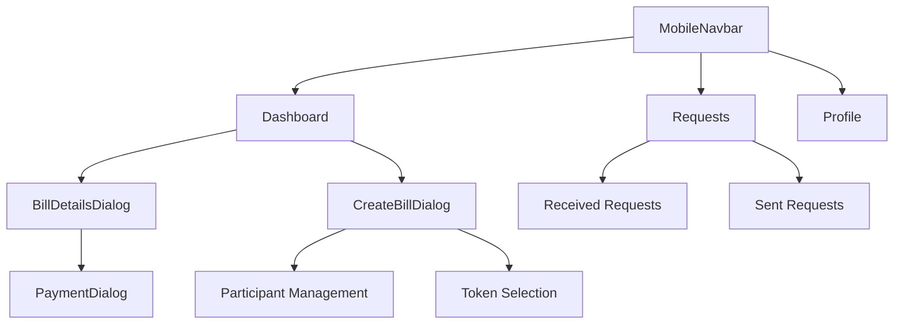
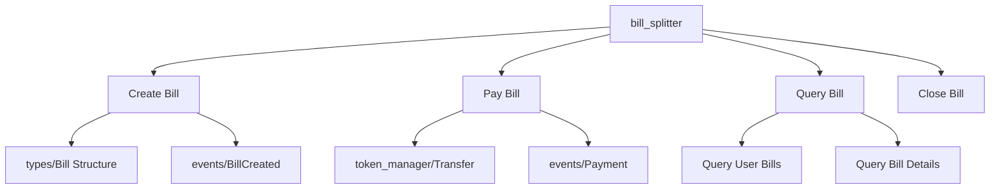
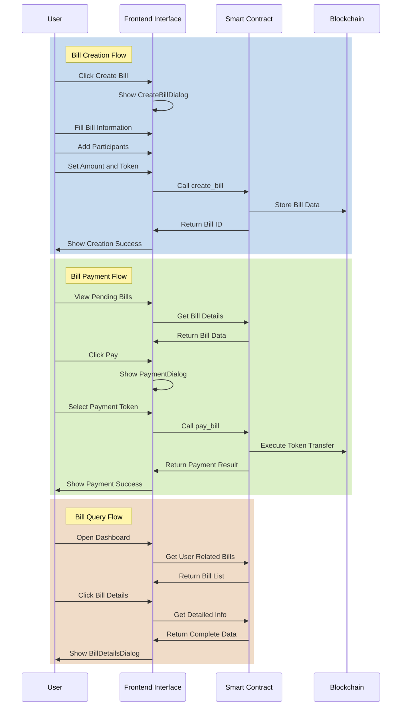
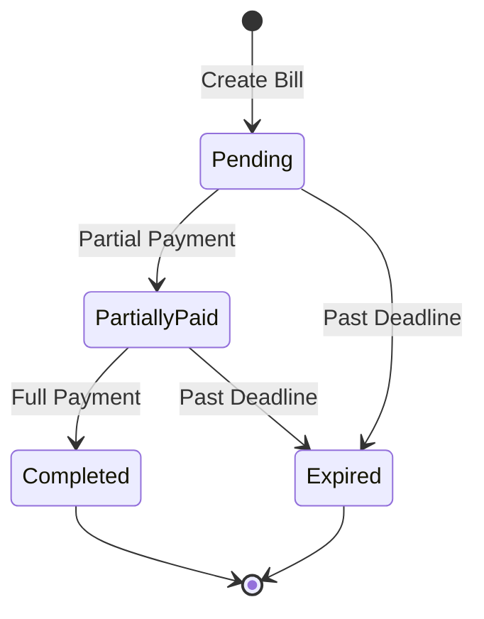
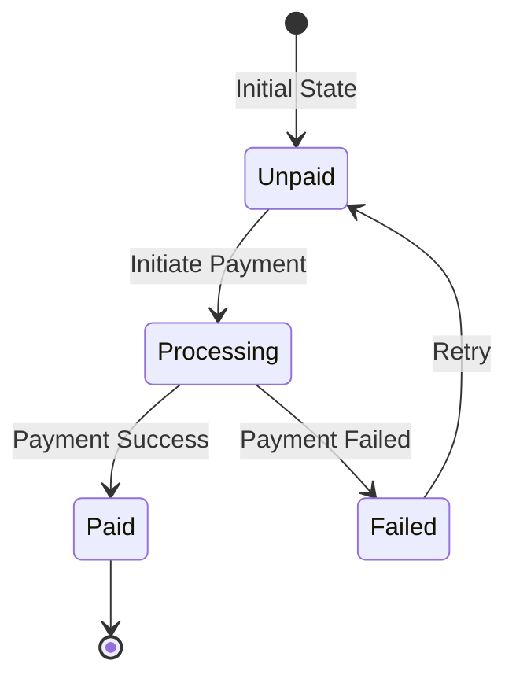

# AptMe - Decentralized Bill Splitting System

## System Architecture Overview

### Frontend UI Module



### Contract Module Structure



### Core Business Flow



## Data Structure Mapping

### Contract Data Structures

```move
struct Bill has key, store {
    id: u64,
    creator: address,
    title: String,
    description: String,
    total_amount: u64,
    token: address,
    accepted_tokens: vector<address>,
    participants: vector<Participant>,
    deadline: u64,
    status: u8,
    created_at: u64,
}

struct Participant has store, drop, copy {
    address: address,
    amount: u64,
    paid: bool,
    paid_amount: u64,
    paid_token: Option<address>,
    paid_at: Option<u64>,
}
```

### Frontend Interface Types

```typescript
interface Bill {
  id: string;
  title: string;
  description: string;
  amount: number;
  token: string;
  creator: {
    address: string;
    name: string;
  };
  participants: Participant[];
  deadline: string;
  progress: number;
  status: "pending" | "completed";
  color: string;
  acceptedTokens: string[];
}

interface Participant {
  address: string;
  name?: string;
  amount: number;
  paid: boolean;
  type: "wallet" | "email";
}
```

## Feature Module Description

### 1. Bill Creation Module (CreateBillDialog)

- **UI Component Responsibilities**:

  - Multi-step form process
  - Participant management (wallet/email)
  - Token selection and amount setting
  - Deadline setting

- **Contract Interaction**:
  ```typescript
  async function createBill(params: CreateBillParams): Promise<string> {
    const { title, description, amount, token, participants, deadline } =
      params;
    return contract.create_bill(
      title,
      description,
      amount,
      token,
      participants,
      deadline
    );
  }
  ```

### 2. Payment Module (PaymentDialog)

- **UI Component Responsibilities**:

  - Display bill details
  - Token selection and balance display
  - Token exchange integration
  - Payment progress display

- **Contract Interaction**:
  ```typescript
  async function payBill(
    billId: string,
    amount: number,
    token: string
  ): Promise<boolean> {
    return contract.pay_bill(billId, amount, token);
  }
  ```

### 3. Bill Management Module (Dashboard/Requests)

- **UI Component Responsibilities**:

  - Bill list display
  - Status filtering and search
  - Payment status tracking
  - Due date reminders

- **Contract Interaction**:
  ```typescript
  async function getBills(): Promise<Bill[]> {
    return contract.get_user_bills();
  }
  ```

## State Management

### 1. Bill Status



### 2. Payment Status



## Security Considerations

1. **Contract Security**

   - Access control
   - Amount validation
   - Reentrancy protection
   - Overflow checks

2. **Frontend Security**
   - Input validation
   - Transaction confirmation
   - Error handling
   - State consistency

## Optimization Suggestions

1. **Performance Optimization**

   - Batch queries
   - Caching strategy
   - Lazy loading

2. **User Experience**

   - Offline support
   - State synchronization
   - Error recovery

3. **Scalability**
   - Plugin system
   - Multi-chain support
   - API version control

## Future Plans

1. **Feature Extensions**

   - Recurring bills
   - Group management
   - Payment reminders

2. **Integration Enhancements**

   - More DEX support
   - Multi-chain assets
   - Social features

3. **Operations Support**
   - Data analytics
   - User feedback
   - Operations tools
